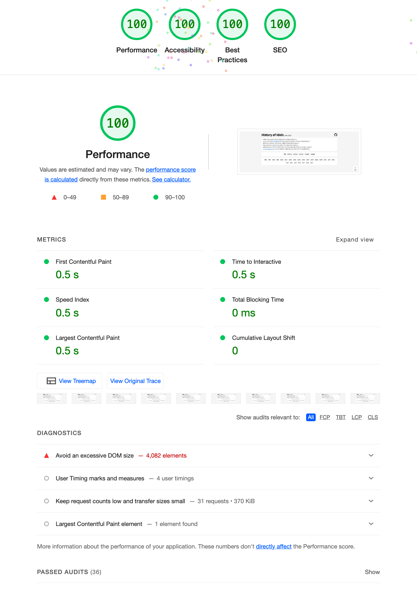

 

# History of Idols

## 일반인을 위한 글

1996년부터 2019년까지의 아이돌 목록을 정리해봤습니다. 아이돌 등재 기준은 ['나무위키 한국 아이돌/역사'](https://namu.wiki/w/%ED%95%9C%EA%B5%AD%20%EC%95%84%EC%9D%B4%EB%8F%8C/%EC%97%AD%EC%82%AC) 입니다.

보다 보면 이 사람이 왜 아이돌이야? 하는 경우도 있을 것 같습니다만, 대량으로 등록하다보면 어쩔 수 없습니다. 직접 해보세요.

정리할 자료가 수백명이나 되다 보니 내용상 누락이나 잘못된 부분이 있을 수 있습니다. ['이곳'](https://github.com/miriyas/idols/issues)에 글을 남겨주시거나, ['miriya.lee@gmail.com'](mailto://miriya.lee@gmail.com)으로 메일을 보내주세요.

정말 큰 도움이 되고 싶을 경우, ['원본 데이터'](https://github.com/miriyas/idols/blob/main/src/constants/idols.ts)를 참조하여 유튜브 주소나 시작 시간 등을 만들어주시면 더욱 좋습니다.

## 개발자를 위한 글

[`create-next-app`](https://github.com/vercel/next.js/tree/canary/packages/create-next-app) 을 이용해 만든 [Next.js](https://nextjs.org/) 프로젝트입니다.

아시죠? 개선하고 싶은 부분이 있다면 PR을 올려주세요.

몇년 전 까지는 유튜브 자동 재생이 되었는데, 막혀버렸네요 :(

