<a href="https://codeclimate.com/github/miriyas/idols/maintainability"></a> [](https://hits.seeyoufarm.com)

# 개발자를 위한 글

[](https://github.com/anuraghazra/github-readme-stats)

[](https://github.com/anuraghazra/github-readme-stats)

[`create-next-app`](https://github.com/vercel/next.js/tree/canary/packages/create-next-app) 을 이용해 만든 [Next.js](https://nextjs.org/) 프로젝트입니다.

짜잔, 실무에서 회사 일 하면서 참 달성하기 힘들던 Lighthouse 100점입니다.

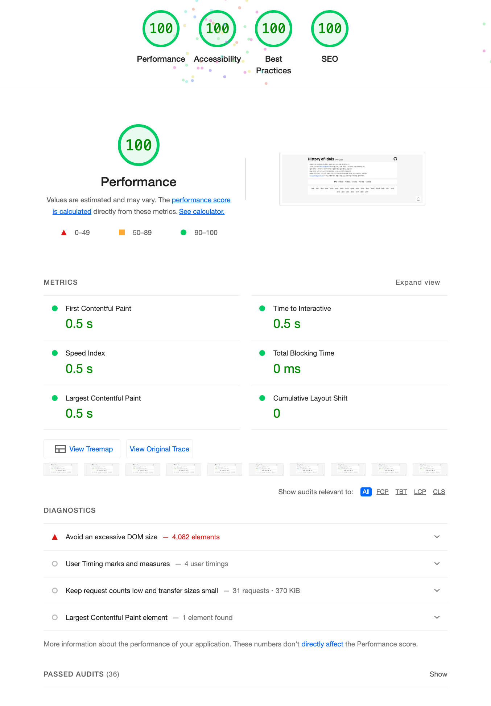

아시죠? 개선하고 싶은 부분이 있다면 PR을 올려주세요.

모든 코드는 빡쎄게 린터를 걸어두었습니다.

https://github.com/miriyas/miriya/blob/main/.stylelintrc.json

https://github.com/miriyas/miriya/blob/main/.eslintrc.json

각종 버튼에는 GA를 붙여두었습니다.

### 목차

1. [History of Idols](https://github.com/miriyas/miriya#history-of-idols)
2. [History of DSLR](https://github.com/miriyas/miriya#history-of-dslr)
3. [Pentaxian Encyclopedia](https://github.com/miriyas/miriya#pentaxian-encyclopedia)
4. [개발자를 위한 글](https://github.com/miriyas/miriya#%EA%B0%9C%EB%B0%9C%EC%9E%90%EB%A5%BC-%EC%9C%84%ED%95%9C-%EA%B8%80)

<br />
<br />

# History of Idols

#### 리뉴얼 후

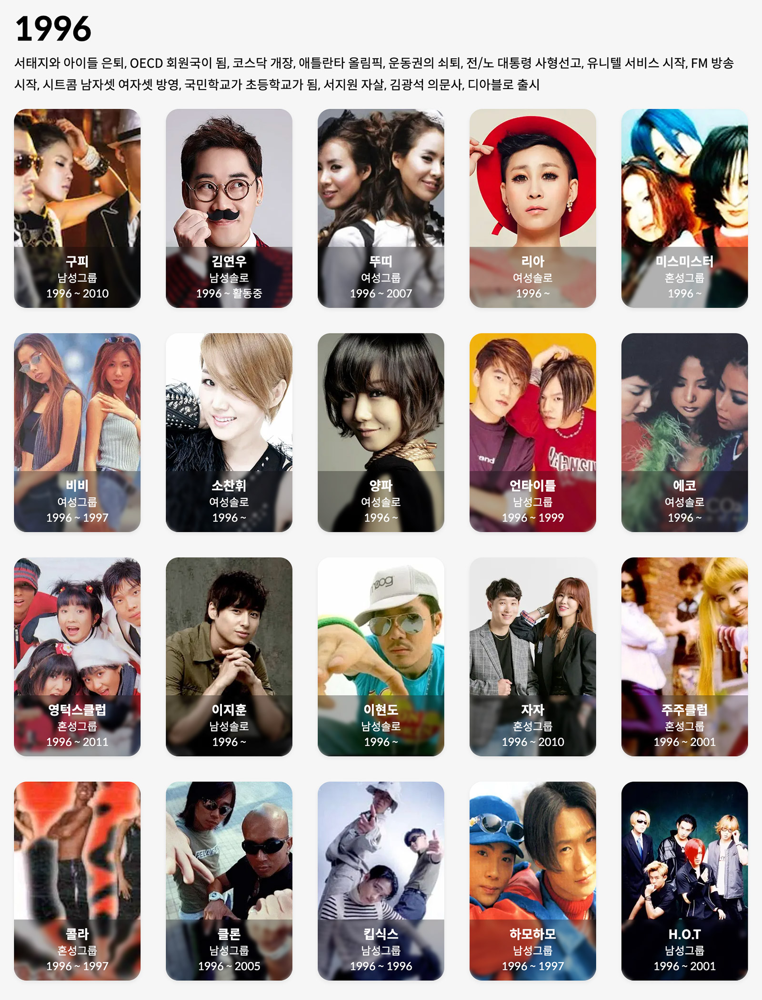

#### 리뉴얼 전

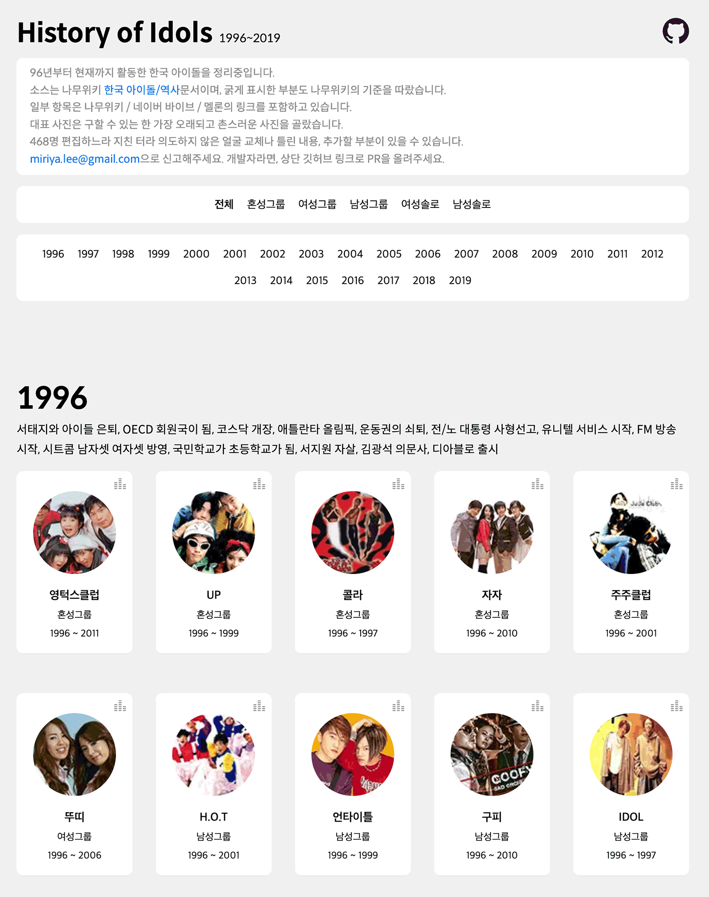

1994년부터 2023년 현재까지의 아이돌 목록을 정리해봤습니다.

각 아이돌을 클릭하면 해당 아이돌이 부른 대표곡의 하이라이트 부분이 재생됩니다. 추억여행 한번 빠져보시죠.

#### 정리 빡쎔

아이돌 등재 기준은 나무위키 ['한국 아이돌/역사'](https://namu.wiki/w/%ED%95%9C%EA%B5%AD%20%EC%95%84%EC%9D%B4%EB%8F%8C/%EC%97%AD%EC%82%AC) 입니다.

저 문서를 긁어다가 [크롤링 샘플](https://miriya.net/idols/crawl) 페이지를 만들어놨는데, 이게 무슨 숙제 같이 되어버렸네요..<br>많아도 너무나 많네요. 한명당 이름, 데뷔 연도, 그리고 까다로운 해체 연도, 그리고 나무위키/멜론/바이브 링크를 걸고, 유튜브에서 음원 찾아다가 고유 아이디와 하이라이트 부분 시간을 입력해야 합니다. 거기다가 아이돌을 검색하여 적당히 잘 나온 세로로 긴 사진을 찾아 포토샵으로 편집해서 올려야하지요.

보다 보면 이 사람이 왜 아이돌이야? 하는 경우도 있을 것 같습니다만, 기준은 나무위키입니다.

정리할 자료가 수백명이나 되다 보니 내용상 누락이나 잘못된 부분이 있을 수 있습니다. ['이곳'](https://github.com/miriyas/idols/issues)에 글을 남겨주시거나, ['miriya.lee@gmail.com'](mailto://miriya.lee@gmail.com)으로 메일을 보내주세요. 주위 친구들 몇명이 서포터로 등록되어 수정이나 추가 등의 작업을 도와주었습니다.

<br />

#### 개발 이야기

예전에 라인 입사할 때 만들었던 리액트 버전 아이돌 리스트의 리팩토링 버전입니다.

아무래도 당시 그 코딩 한지 엄청나게 오래되다보니, 컴포넌트는 막 클래스 컴포넌트에 파일 하나 길이가 800줄을 넘어가고 어마어마하더군요. 깃허브에 이걸 남겨두면 인생 종칠것 같아서 리팩토링 했습니다.

몇년 전 까지는 유튜브 자동 재생이 되었는데, 막혀버렸네요 :(

이번 제 작업 목록의 첫번째이며, Next.js를 사용해서 만들었습니다. 그리고 하는 김에 Next 13의 experimental appDir로 만들었네요.

즐겨 쓰던 Isotope 라이브러리를 사용하여 반응형 목록 재정렬 기능을 만들었고, 대부분의 작업은 자료 수집 노가다네요.

작업 중간에 Youtube JS 라이브러리를 사용하려고 했는데, 아예 전체 레이아웃을 다 바꿔야 해서 작업하지 않았습니다. 1996년부터 주요곡들을 한번에 다 들을 수 있게 해달라는 요청이 있었는데, 흐음, 그보다는 내용을 다 채우는게 우선이 될 것 같네요. 하아 이거 알바를 뽑을 수도 없고 ㅋㅋㅋ.. 천천히 하겠습니다.

2023년 3월 30일 :

일본의 사용자가 인터넷이 느리다 하여 아이돌 이미지들을 연도별로 모아 ImageSprite로 데이터 요청 수를 줄였습니다.

2023년 4월 25일 :

하지만 아이돌을 추가하고 수정하는 기능을 만들다 보니 이미지 추가가 너무 번거로워져 다시 개별 이미지로 회귀했습니다. 하는 김에 이미지 품질도 끌어올리고, 디자인도 좀 더 모던하게 변경했습니다. 아무래도 조만간 Isotope를 떼어내고 좀 더 심플하게 가는게 어떨까.. 하는 생각이 들기도 합니다.

매번 나무위키를 보면서 확인하기 힘들어서, ['한국 아이돌/역사'](https://namu.wiki/w/%ED%95%9C%EA%B5%AD%20%EC%95%84%EC%9D%B4%EB%8F%8C/%EC%97%AD%EC%82%AC) 문서를 파싱하여 [크롤링 샘플](https://miriya.net/idols/crawl) 페이지를 만들었습니다. 근데 이게 참 ㅋㅋ 나무위키 크롤링을 할라니까 서버를 너무 잘 만든겁니다. 그래서 그런지 2019년 이후로는 크롤링 성공했다는 블로그 글이 안보이더군요. 몇번 트라이 해보고, 본질은 이게 아니겠다 싶고 시간 낭비 하기 싫어서 그냥 저 페이지의 HTML을 그냥 긁어다 복사했습니다.

<br />

# History of DSLR

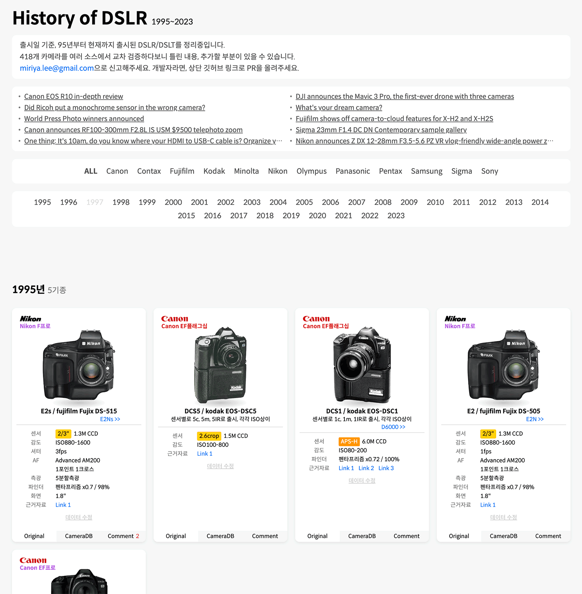

출시일 기준, 1995년부터 2023년 현재 까지의 DSLR 및 렌즈 교환식 카메라들을 정리해봤습니다.

저는 대학생 시절 SLR클럽 활동을 활발하게 했었고, 당시에 플래시와 포토샵으로 [카메라 족보](http://www.slrclub.com/bbs/vx2.php?id=best_review&no=2248)와 [펜탁스 렌즈의 계보표](http://www.slrclub.com/bbs/vx2.php?id=pds&no=28147)를 만든 적이 있었지요.

이번 History of DSLR은 12년 전에 만들었던 포토샵 버전 [카메라 족보](http://www.slrclub.com/bbs/vx2.php?id=best_review&no=2248)의 웹 리뉴얼 버전입니다.

<br />

#### 개발 이야기

이번 Next.js experimental AppDir을 사용하게 되며 가장 힘들었던 부분인데요, 일단은 쿼리스트링과 해시로 라우팅 하기가 매우 까다롭습니다. next@13.2.3-canary.20 버전 기준으로 리랜더 문제와 해시값 가져올 수 없는 문제들이 있어 SSR과 병행하기 참 힘들었습니다. 코드를 보시면 별 쓸데 없는 곳에 굳이 이벤트리스너를 다는 등 상당히 성가시게 구현해놓은 모습을 볼 수 있습니다. 아마 버전업이 되어가면서 하나하나 단순하게 고쳐나가지 싶네요. 이딴걸 구현하려고 이렇게 했다고?? 싶은 부분이 조금 보일겁니다. [Successor/Prodecessor 링크 부분](https://github.com/miriyas/miriya/blob/main/src/containers/cameras/CameraYears/CameraCard/DataInternal/Siblings/SiblingLink.tsx)이 제일 빡쎘습니다. [Categories](https://github.com/miriyas/miriya/blob/main/src/containers/cameras/Top/Categories.tsx) 부분에선 searchParam 을 사용하는데, 클릭할 때 마다 페이지가 새로고침 되는 문제가 있었습니다. 이 문제는 [13.4.0](https://github.com/vercel/next.js/releases/tag/v13.4.0) 에서 해소되었습니다.

필터를 빡쎄게 넣으면서 Isotope는 걷어내고 일반적인 flex로 정렬했습니다. 특기할만한 것은, [DigicamDB](https://www.digicamdb.com/)라고 외국의 어떤 분이 저 처럼 원맨 삽질을 하며 정리해놓은게 있길래, 이번 Next api 라우트를 사용해 서버사이드 요청 / HTML 파싱을 하는 기능을 만들어봤습니다. 그리고 DigicamDB 클릭시 카드가 휙 돌아가면서 나오는 부분은 CSS의 backface-visibility를 사용했습니다. 남의 홈페이지에 테러하지 않기 위해 캐싱을 잘 해두려 했는데, 아이고 맙소사.. Next.js 현재 버전에서는 요청을 한번이 아니라 두번씩 보내는 버그가 남아있습니다.

카메라 하단에 잘 보면 흐릿한 그림자가 보이는데요, CSS만으로 구현했습니다. 카메라 이미지는 모두 흰색 배경의 정사각형 JPEG 파일인데, 그림자를 띄운 다음 CSS의 mix-blend-mode: multiply 를 이용해 이미지가 뒷배경에 녹아들게 만들었습니다. 흰 배경 정사각형이라 유사한 drop-shadow()를 쓸 수 없어 조금 아쉬웠던 부분.

카메라 이미지들은 16x16px의 블러 이미지를 플레이스홀더로 넣어두었습니다. 보니까 카메라들이 축소하면 다 비슷하게 보여서 한장으로 다 퉁칠 수 있었네요.

이후에 댓글 기능을 달고, 수정 기능을 달고, 수정을 할 경우 누가 어떤 부분을 수정하는지 기록을 남기는 기능도 만들었습니다. 해당 기능은 파이어베이스로 구현했습니다. 아... 애초에 그냥 노드로 서버 짜서 만들걸 뭣하러 파이어베이스를 썼을꼬...

또 크롤링 기능을 만든 김에 아예 상단에 DPreview의 카메라 뉴스를 보여주도록 만들었습니다. 처음에는 HTML을 싹 긁을라다가, DPreview에서 RSS를 제공하고 있길래 그걸 사용했죠. cheerio를 사용했는데, XML의 경우 xmlMode: true를 넣어줘야 정상 작동합니다.

<br />

# Pentaxian Encyclopedia

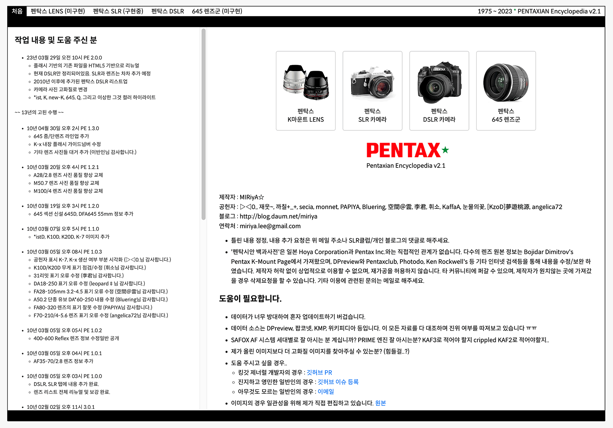

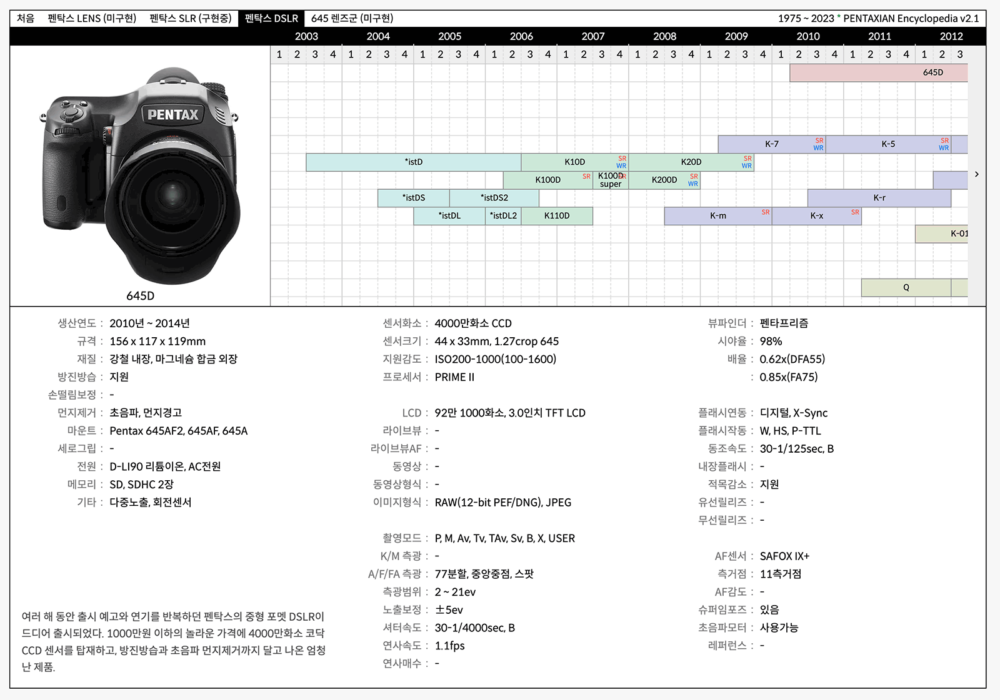

SLR클럽 활동 시절에 플래시로 만들었던 [펜탁스 렌즈 계보표](http://www.slrclub.com/bbs/vx2.php?id=pds&no=28147)의 웹 버전입니다. 당시 여러 회원분들의 도움을 받아 자료를 취합하여 꾸역꾸역 만들 수 있었네요. 12년만에 디자인을 똑같이 유지하며 웹 버전으로 재탄생 했습니다.

<br />

# My Car

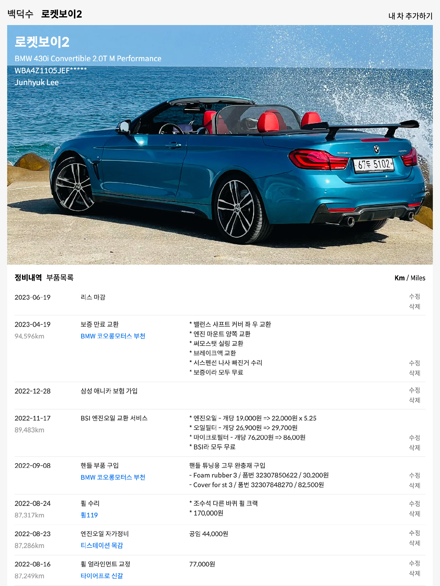

평소에 마이클 앱과 메모장을 이용해 차계부를 관리해왔습니다.

이번에는 뭘 만들어볼까 하다가, 쓰던 차계부를 관리하기 위한 간단한 서비스를 만들어봤습니다.

마이클 처럼 차량 정비 기록도 남기지만, 거기 더해 튜닝/호환 부품 목록도 적을 수 있게 했습니다.

별거 아니긴 하지만 제겐 꼭 필요한 기능입니다.

또한 미국에 사는 차쟁이 친구를 위해 마일 변환 기능을 넣었습니다. 아.. 좀 살것 같네;;

그리고 사용중인 CDN에 사진을 올리고 싶었는데, Next.js appDir에서 S3 SDK가 경로를 못잡는 문제가 있어 실패.

#### 개발 이야기

아시다시피 플래시가 전부 지원 중단이 되어버려서, PaleMoon 브라우저에 오래된 플러그인 설치하여 겨우 예전 파일을 열어서 스크린샷을 찍어다가 웹 버전으로 옮겼습니다.

각종 리드미나 글 들은 마크다운 파일로 만들어 렌더링했습니다. 서브라우팅 부분은 Next AppDir의 layout을 사용했고, 타임라인 부분은 드래그해서 스크롤 할 수 있게 만들었습니다. 맨 우측의 화살표 부분은 IntersectionObserver를 사용했습니다. 캔버스로 구현할까 하다가, 목적에 맞지 않는것 같아 단순 HTML로 작업했네요.

타임라인의 모눈의 경우, 처음에는 ul/li를 사용했는데, 가로로 120개, 세로로 15개 해서 총 1800개의 DOM을 만들어야 했습니다. 이거 도저히 무식해서 눈뜨고 봐 줄 수가 없어서 방법을 찾다가, repeating-linear-gradient 4중첩을 이용해 DOM 하나로 구현해냈습니다. [src/containers/pentax/TabDSLR/index.module.scss](https://github.com/miriyas/miriya/blob/main/src/containers/pentax/TabDSLR/index.module.scss#L75) 참고.

<br />
<br />

## 다음 작업?

아마도 i18n 작업이나 댓글 기능을 달지 않을까 싶네요. i18n은 Next AppDir에서 난리도 아니라는 말이 있어서 조금 긴장하는중.

...는 댓글도 달았고, 댓글 달라고 로그인도 만들고, 로그인 만들다보니 권한 관리도 만들고.. 수정 기록도 만들고, 심지어 추가 기능까지 만들고...

<br />
<br />

# [Next.js 13 canary](https://github.com/vercel/next.js/releases) with Experimental appDir

- 현재 canary 30에서도 아래 문제들은 재현되고 있음.

## 현재까지 알아낸 Next.js 13 + appDir 관련 이슈 목록

1. 해시 아이디로 링킹 오작동

- https://github.com/vercel/next.js/issues/42157
- next@13.1.2 에서도 수정되지 않았다.

영향 받는 코드 : src/components/Camera/Table/DataSiblings/SiblingLink.tsx

2. next/dynamic 사용시 프로덕션에서 일부 chunk 404

- 프로덕션에서만 재현됨
- 단일 페이지 앱에선 재현 안되며, 타 라우트로 이동해야 함
- 모든 컴포넌트를 주석 처리하면 재현 안되지만, 진짜 [간단한 컴포넌트](src/containers/profile/index.tsx)라도 404유발됨
- client-reference-manifest.json에 저장되는 경로가 잘못 들어감. (예를 들어 830-004c10da4a4c61af.js 가 있는데 기록되는건 830-s0meth1ngwr0ng.js)
- Next 뿐만 아니라 Nuxt에도 유사 이슈 있다 함
- next/dynamic 자체를 아예 쓸 수 없게됨
- https://github.com/vercel/next.js/issues/47173
- [Next@13.3.1-canary.16](https://github.com/vercel/next.js/releases/tag/v13.3.1-canary.16)에서 수정되었다.

3. appDir일 경우 CSS 프리로딩 안됨, FOUC 유발됨

- 첫 페이지일 경우엔 문제 없으나, 타 페이지로 이동하면 CSS 로딩이 늦음
- 헤더에 <link style> 부분에 preload 안붙어서 concat 됨
- 프로덕션과 로컬 모두 재현됨
- https://github.com/vercel/next.js/discussions/41745#discussioncomment-5106716
- https://github.com/vercel/next.js/issues/46197
- https://github.com/vercel/next.js/issues/46510
- https://github.com/vercel/next.js/issues/46868
- https://github.com/vercel/next.js/issues/46947
- next@13.3.0에서 해결되었다. 어우 후련해..

4. i18n 적용시 인스턴스가 무한 생성됨

- https://locize.com/blog/next-13-app-dir-i18n/

5. 서버 중복 요청 문제

- app/api 폴더에 api 만들어서 사용하면, 서버에서 타 페이지로 요청이 한번이 아니라 두번 감

6. 컴포넌트 중복 마운트 문제

- 마운트가 두번 됨, useMount 사용 불가능
- React StrictMode 꺼도 마찬가지임

7. 특정 훅 사용시 SSR/메타데이터 파괴

- useSearchParams 쓸 경우, 해당 컴포넌트 부모중 Suspense가 있는지 찾아올라감
- 위로 타고 올라가다가 Suspense가 정 없으면, SSR 다 박살내고 CSR로 로딩, 페이지 메타태그 안나옴
- 아주 조용히 문제가 생겨서 실무에 쓰기엔 너무 위험해보임
- https://beta.nextjs.org/docs/rendering/static-and-dynamic-rendering#using-dynamic-functions
- 다음 넥스트 버전에선 해당 훅 사용시 뭔가 경고라도 띄웠으면 좋겠다. 거의 소리없는 암살자 수준
- 업데이트 : https://nextjs.org/docs/messages/deopted-into-client-rendering 공식 문서가 추가되었다.

<br />
<br />

## 삽질 기록

1. 서버와 클라이언트의 소팅이 다르다?

```
const idols = ['고구려', '박지윤', '베이비복스', '스페이스A', '자우림', '젝스키스', '지누션', '태사자', '홍경민', 'NRG', 'S.E.S', 'TNB', 'UNO'];

idols.sort((a, b) => a.name.toLowerCase().localeCompare(b.name)) // 1

sortBy(idols, 'name', 'asc') // 2

idols.sort((a, b) => {
  if (a.name.toLowerCase() === b.name.toLowerCase()) return 0;
  return a.name.toLowerCase() < b.name.toLowerCase() ? -1 : 1;
}); // 3

// server
// ['NRG', 'S.E.S', 'TNB', 'UNO', '고구려', '박지윤', '베이비복스', '스페이스A', '자우림', '젝스키스', '지누션', '태사자', '홍경민']

// client
// ['고구려', '박지윤', '베이비복스', '스페이스A', '자우림', '젝스키스', '지누션', '태사자', '홍경민', 'NRG', 'S.E.S', 'TNB', 'UNO']
```

위 세가지 코드로 배열을 정렬할 경우, 서버와 클라이언트에서 순서가 다르게 나옴.

https://developer.mozilla.org/ko/docs/Web/JavaScript/Reference/Global_Objects/String/localeCompare

- localeCompare에 두번째 인자가 있었다.
- 서버와 클라이언트의 로케일이 달라서 생긴 문제였음.

2. 메타데이터가 갑자기 안나온다!

- 페이스북이나 카카오톡으로 공유를 했는데, 기존에 pages 로 작업한건 문제가 없지만 appDir로 바꾼 직후 미리보기 이미지가 안나오더라
- [페이스북 디버거](https://developers.facebook.com/tools/debug/?q=https%3A%2F%2Fmiriya.net%2Fcameras)로 확인해보니 og-image가 나오지 않고 있음
- '스크레이퍼에게 표시되는 URL 그대로 보기'로 확인해보니 head 부분에 메타데이터가 없고, **next_error** 가 보인다.
- https://github.com/vercel/next.js/issues/47350
- https://beta.nextjs.org/docs/rendering/static-and-dynamic-rendering#using-dynamic-functions
- https://github.com/vercel/next.js/commit/b3dfa037670c8601332edb7c749b48f588d9e72a
- bailout-to-client-rendering 호출되면 CSR로 전환되는듯.

3. id로 라우팅 하기가 힘들다.

- src/components/Camera/Table/DataSiblings/SiblingLink.tsx
- 위 파일에서 각 카메라들의 후속기로 이동하는 링크를 구현했음.
- 클릭 하면 스무스하게 스크롤해서 해당 카메라로 이동하는 간단한 기능
- next/link의 <Link> 사용하니 href='#id' 넣어도 제대로 작동하지 않았음, 리랜더가 유발되며 페이지가 전환됨
- https://github.com/vercel/next.js/issues/42157
- 매우 부득이하게 pushState로 url 업데이트하고, 별도로 hashchange 이벤트를 쏴서 현재 기종 하이라이트 구현함
- asPath가 삭제되어, 공식적으로 제공되는 훅으로 id를 알아낼 수가 없다.
- next@13.3.0에서도 수정되지 않았음.

4. queryString으로 라우팅 하기도 힘들다.

- src/containers/cameras/FilterBar/index.tsx
- /cameras?maker=nikon 등으로 링크 이동시 리랜더됨
- pushState로 처리함

5. 사파리에서 idol 이미지 border-radius 오작동

- 처음엔 잘 나오는데, 주변 다른 아이돌을 클릭해서 확장할 경우 둥글게 처리 된 것이 사각으로 나옴
- 웹킷 버그였음. https://stackoverflow.com/questions/49066011/overflow-hidden-with-border-radius-not-working-on-safari

6. next super json 라이브러리 사용시 앱 구동 불가

- NEXT-939 SIGSEGV on next build with 13.2.4 [#46989]: https://github.com/vercel/next.js/issues/46989

7. 프리로딩 관련 경고 뜨는 문제

`The resource <URL> was preloaded using link preload but not used within a few seconds from the window's load event. Please make sure it has an appropriate `as` value and it is preloaded intentionally.`

이슈가 콘솔창에 계속 보여서 확인해봤는데, 이미 [이슈]: https://github.com/vercel/next.js/issues/6517 가 있었고, 넥스트 측에서는 중요하지 않다고 묵살한 모양. preload가 아니라 prefetch 쓰면 되는데 설정이라도 할 수 있어야 할것 아니냐- 했지만...

8. 이미지 사이즈 관련 경고 뜨는 문제

- pentax-logo 원본 이미지가 301x40이었는데, 150x20으로 렌더링하는 과정에서 경고를 보여주었다. width auth, height auto로 변경하라 해서 했지만 문제 해결되지 않았음. 포토샵 열어서 1px 지우고 300x40으로 바꿔주니 경고가 사라졌다..

9. 청크 용량 문제

- 처음에는 댓글 기능 달기 위해 파이어베이스를 달았고, 이게 청크 크기 문제를 야기했음.
- 파이어베이스 SDK 자체의 용량이 너무 커서, 파이어베이스를 사용하는 청크 용량은 기본 100kb~200kb를 넘어가버린다.
- 트리쉐이킹이 되는 V9 버전에서도 문제가 생기는거라, 그냥 SDK의 용량이 큰게 문제.

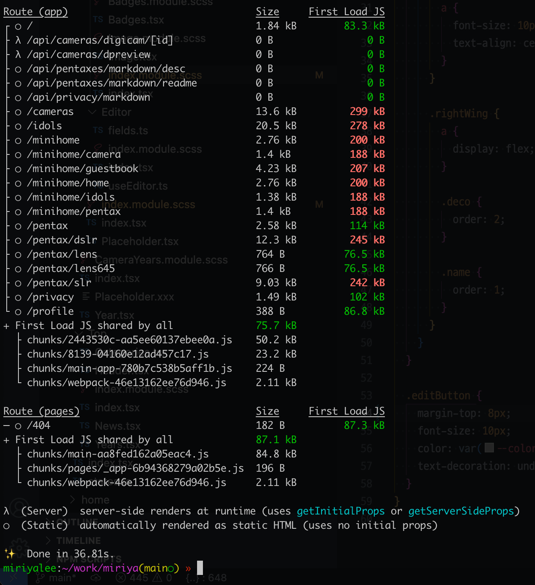

- 위 스크린샷 처럼 대부분의 청크 파일이 붉은 색으로 고용량이라 경고를 표시하고 있었다.
- Next v13.3.1부터 modularizeImports를 지원하게 되었고, lodash 라이브러리에 한해 적용해보았다.

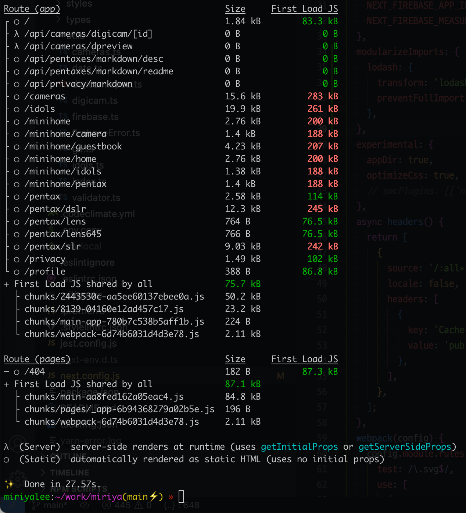

- /cameras가 16kb 정도 줄어든걸 발견할 수 있다.

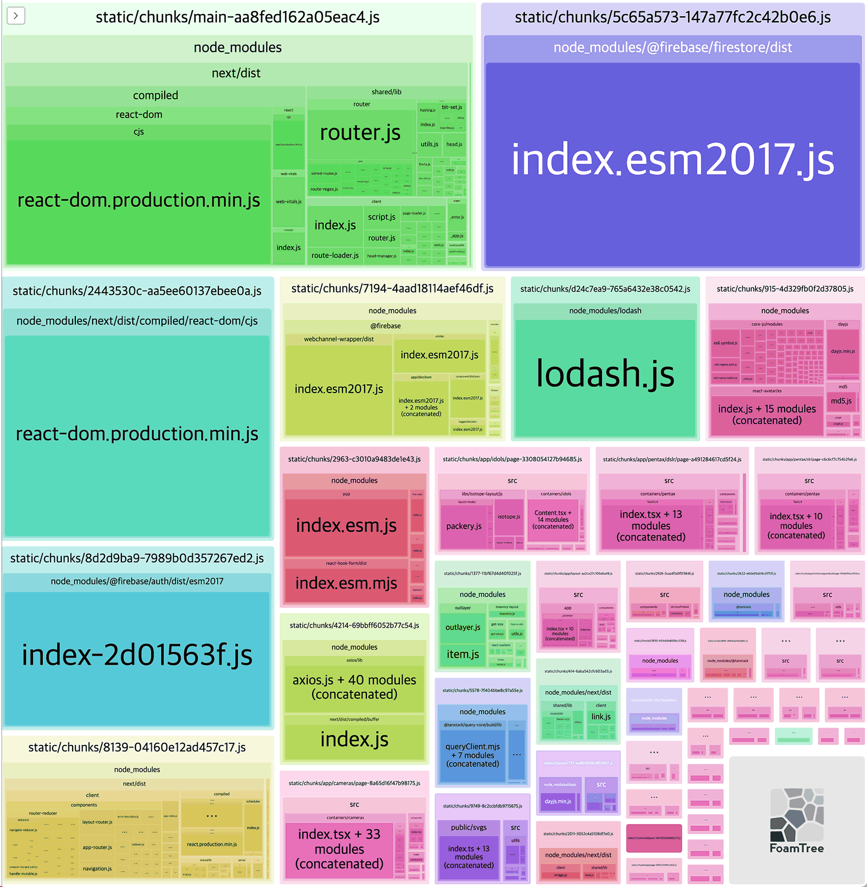


- 우측에 보이던 lodash가 순식간에 사라진걸 볼 수 있다. 하지만 턱없이 부족하다.
- firebase 라이브러리는 이미 최적화가 많이 되어있어서 적용해도 효과가 없었다.

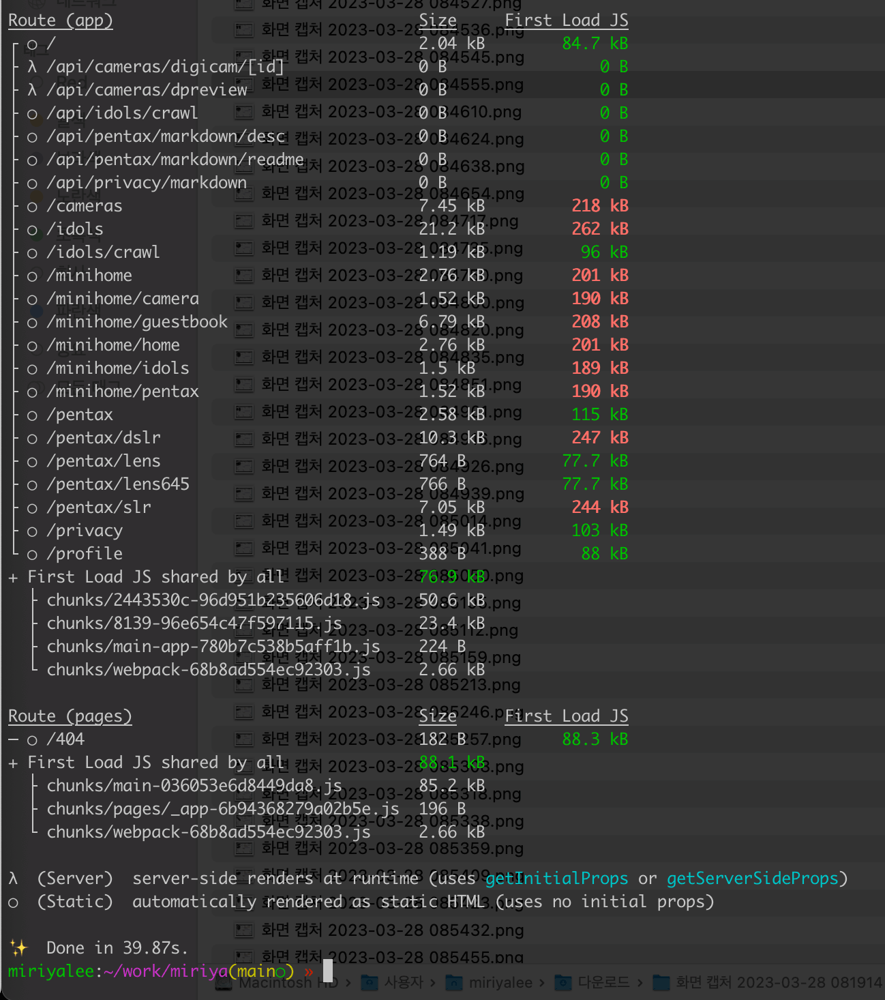

- https://github.com/vercel/next.js/issues/47173
- dynamic import를 적용하면 청크 파일이 랜덤하게 404가 뜨는 문제가 있었는데, v13.3.1-canary.15 부터 수정되었다.
- dynamic import를 하나 적용해본 결과 /cameras용량이 확 줄어든게 보인다. 이제 다 적용해보자.

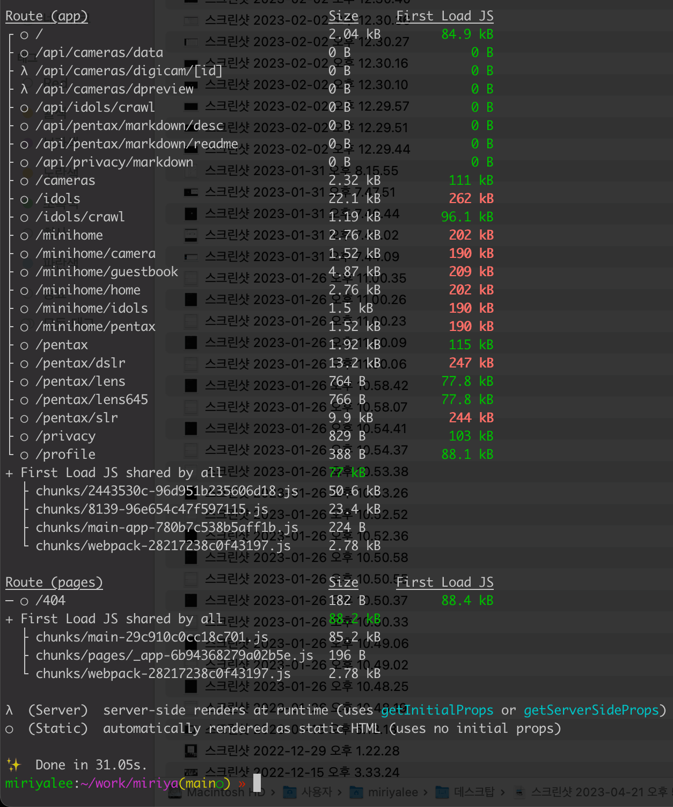

- 파이어베이스를 프론트엔드 자체에서 사용하지 않고, NEXT의 api route에서 불러다가 결과만 주게 만들어보았다.
- 이 경우 파이어베이스 SDK를 프론트엔드에서 돌릴 필요가 없어지고, 그냥 GET/POST만 하면 되니까 청크 용량이 확 준다.

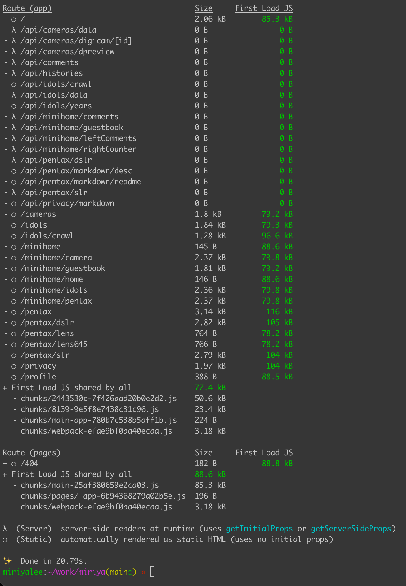

- dynamic을 쓰고, 모든 API들을 다 이동시켰더니 이렇게 올 그린을 볼 수 있었다.
- dynamic을 쓸 때는 Suspense로 잘 감아주었는지 확인해야 하고, 렌더링이 이상하지 않은지 잘 확인해야한다.

10. 모든 API를 서버 레포로 이전

- 윗단계에서 모든 API를 다 서버로 이동시켰는데, 하는 김에 API와 프론트엔드를 분리하고 싶었다.
- 일단 수정/삭제 인증 등을 프론트에서 진행했기에 누구나 다 뚫을 수 있었고, 심지어 코드가 공유되어있으니 보안 문제가 크다.
- 그래서 app/api 안에 내용을 통으로 떠다가 새로운 비밀 레포에 옮겨버렸다.
- 일부 ENV 값들을 수정해주고, CORS 설정을 조금 해주니 금방 적용되었다.

11. 일부 API CORS 문제

- 하지만 프론트/백엔드 간에 세션 검증을 딱히 하고 있지 않아 쉽게 해킹이 가능해서 쿠키 세션을 추가하려고 한다.
- 프론트엔드에서 파이어베이스로 인증을 하고 idToken을 서버로 넘기면, 서버에서 쿠키 세팅을 해주는 API를 만들고자 했다.
- 근데 이상하게도 쿠키 세팅 API에서만 CORS 문제가 떴다.
- 동일한 POST 요청임에도 불구하고 comment 부분은 CORS 문제가 없다.
- POST 요청 안에 쿠키 관련된것들을 다 지우고 'aaa'만 보내고, 'bbb'만 받게 해도 CORS 문제가 잔존한다.
- OPTIONS 부분에 문제가 있을거라 생각하고 [문서](https://beta.nextjs.org/docs/api-reference/file-conventions/route#http-methods) 를 봤는데, 문서에는 OPTIONS를 정의하지 않으면 자동 생성한다더라.
- 하지만 뭔가 뒤가 구렸고, 정상 작동하는 comment와 비교해보았다.
- GET 요청이 하나라도 있어야 OPTIONS가 자동 생성되는걸 확인, NEXT쪽에 문서 보강을 권했다.
- CORS 문제 해결할 때는 파이어폭스가 기가막히더라. 헤더 비교까지 해준다. 최고.

12. 또 일부 API CORS 문제

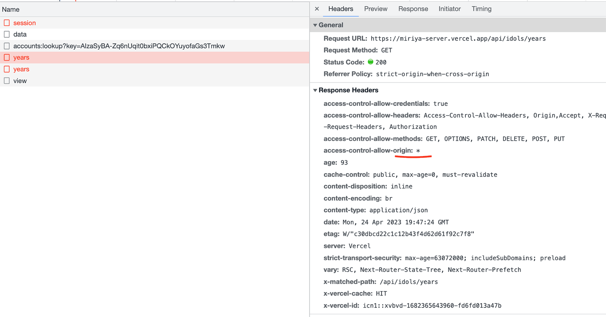

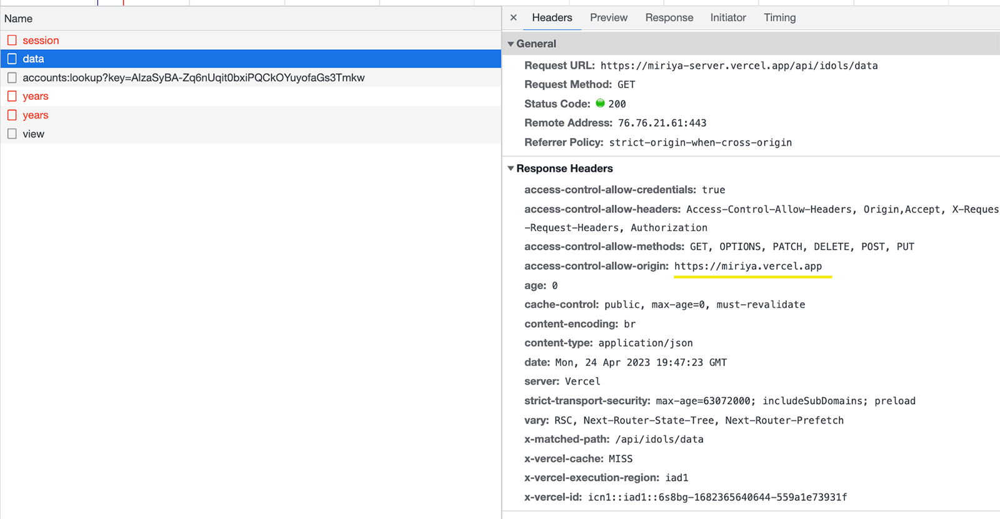

- 로컬에선 잘 작동하던 것이 프로덕션에서는 '일부' API만 문제가 생기더라.
- 나는 분명 Access-Control-Allow-Origin을 https://miriya.net/ 로 잘 지정했다.
- 근데 배포할 때 일부 API만 '\*' 으로 변경되어 CORS 문제를 초래했다.
- /api/idols/data는 문제 없고, /api/idols/years만 문제가 있다.
- 둘 다 안에 간단한 GET 요청이 있었고, 차이점이라곤 data 부분에는 PATCH도 있었다.
- 혹시나 하여 years에 의미 없는 PATCH 요청을 추가하니 Access-Control-Allow-Origin이 변경되지 않고 문제가 해결되었다.
- 결론: 넥스트 appDir은 정말 무시무시하다.. 넥스트측에 버그 리포팅도 했다.
